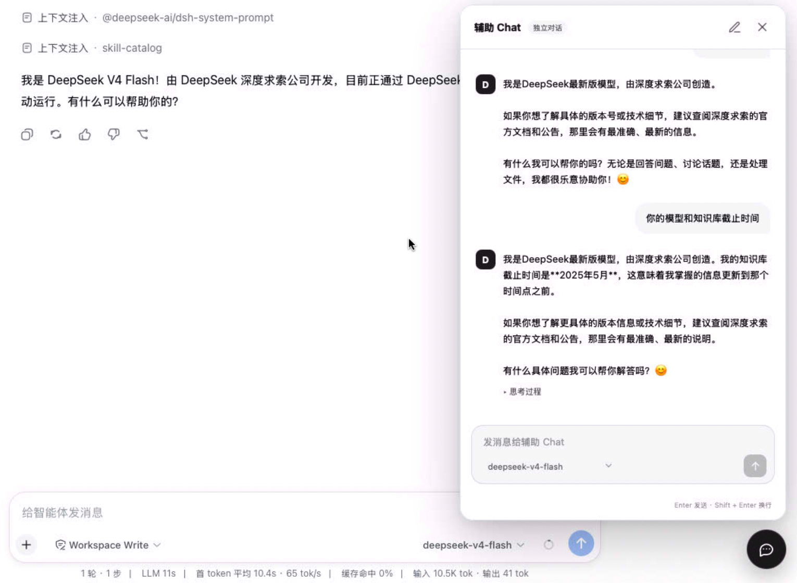

# dsh-inline-chat

DSH Web 全局辅助 Chat 插件：在页面右下角提供一个悬浮按钮和独立聊天面板，方便随时进行一次辅助问答。

## 功能效果

打开右下角悬浮 Chat 后，可以在独立面板中发送消息并查看模型回复。辅助 Chat 使用 DSH 当前可用的模型和账号，但不会进入工作区会话记录。



## 使用方式

### 1. 构建插件

```bash
pnpm install
pnpm typecheck
pnpm build
```

### 2. 安装到 DSH Web profile

将下面的路径替换成插件实际所在目录：

```bash
dsh plugin --profile web add link:/path/to/dsh-inline-chat
```

然后重启 DSH Web：

```bash
dsh web
```

如果之前安装过旧版本，建议先移除再重新安装：

```bash
dsh plugin --profile web remove dsh-inline-chat
dsh plugin --profile web add link:/path/to/dsh-inline-chat
```

### 3. 开始使用

1. 打开 DSH Web 后，点击右下角的悬浮 Chat 按钮；
2. 在输入框输入问题，按 `Enter` 发送；
3. 使用 `Shift + Enter` 换行；
4. 生成过程中发送按钮会切换为停止按钮，可中止当前回复；
5. 在输入框底部切换模型；当前模型提供推理强度配置时，才会显示推理强度选择；
6. 点击“新建”会清空当前辅助 Chat 并开始新的 Chat；
7. 关闭面板不会清空内容，刷新或重启后会从浏览器本地恢复当前辅助 Chat。

## 与工作区会话的关系

- 与当前工作区、当前页面和左侧会话记录完全独立；
- 不创建、不更新、不删除 DSH 会话记录；
- 不读取当前页面内容，也不会把当前工作区会话作为上下文；
- 只保留一个当前辅助 Chat，“新建”是清空并重新开始，不会生成可切换的隐藏历史会话。

## 模型和本地状态

- 默认跟随 DSH 当前模型；
- 可在输入框底部切换 provider/model；
- 模型选择保存在浏览器本地，下次打开继续使用；
- 消息只保存在插件自己的本地状态中，不写入 DSH 会话 store；
- 不保存 Host token、provider 凭据或其他敏感信息。

## 常见问题

### 安装时卡在 `cloudflared`

本插件不依赖 `cloudflared`。如果安装过程卡在 `node_modules/cloudflared` 的 postinstall，通常是 DSH Web profile 的其他依赖安装步骤，不是 `dsh-inline-chat` 主动启动了 cloudflared。请先区分 profile 依赖安装问题和插件构建、加载问题。

### 修改代码后页面没有变化

执行以下步骤，确保重新生成并加载最新的 Client bundle：

```bash
pnpm build
dsh plugin --profile web remove dsh-inline-chat
dsh plugin --profile web add link:/path/to/dsh-inline-chat
dsh web
```

## 开发

```bash
pnpm install
pnpm typecheck
pnpm build
```
